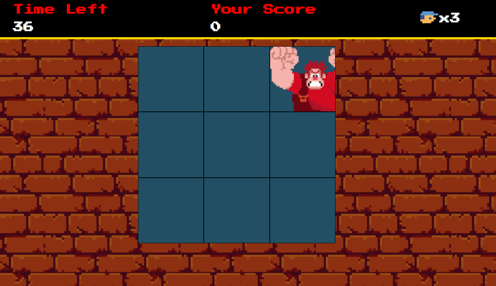

# 📂 Projeto Jogo Detona Ralph

## 📃 Projeto desenvolvido durante Bootcamp Potência Tech iFood - Desenvolvimento de Jogos na plataforma da DIO

 

## 🚀 Tecnologias

- HTML
- CSS
- JavaScript
- Git e Github

 

## 💻 Projeto
> Frontend da aplicação 📸

  

[Acessar o projeto](https://wsawebmaster.github.io/js-jogo-detona-ralph/)

 

## 👨‍💻 Funcionalidades

- **Sistema de Pontuação**: Acompanhe sua pontuação à medida que progride no jogo
- **Timer**: Duração de um minuto para cada partida

 

## 🎯 Como Jogar

1. Clique sobre a imagem do Ralph que será exibida para pontuar
2. Se atente ao tempo e se supere obtendo o maior número de pontos possível
3. Desafie seus amigos a superá-lo 😉

---
---
## 📧 Contato
[LinkedIn](https://www.linkedin.com/in/wsawebmaster/)

wsawebmaster@yahoo.com.br
